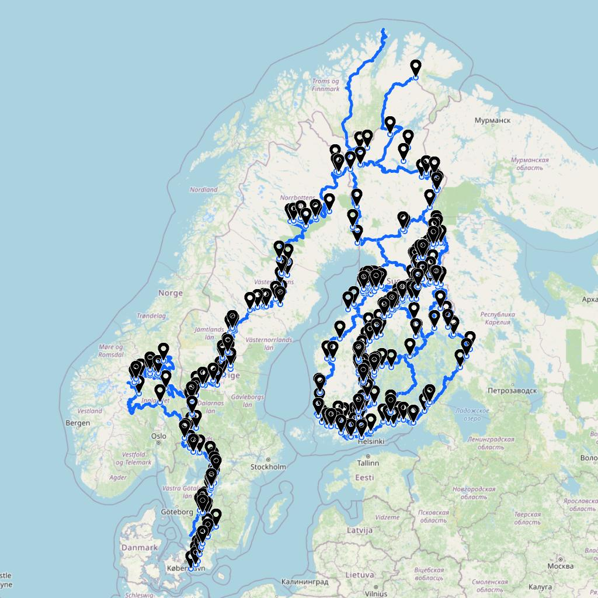
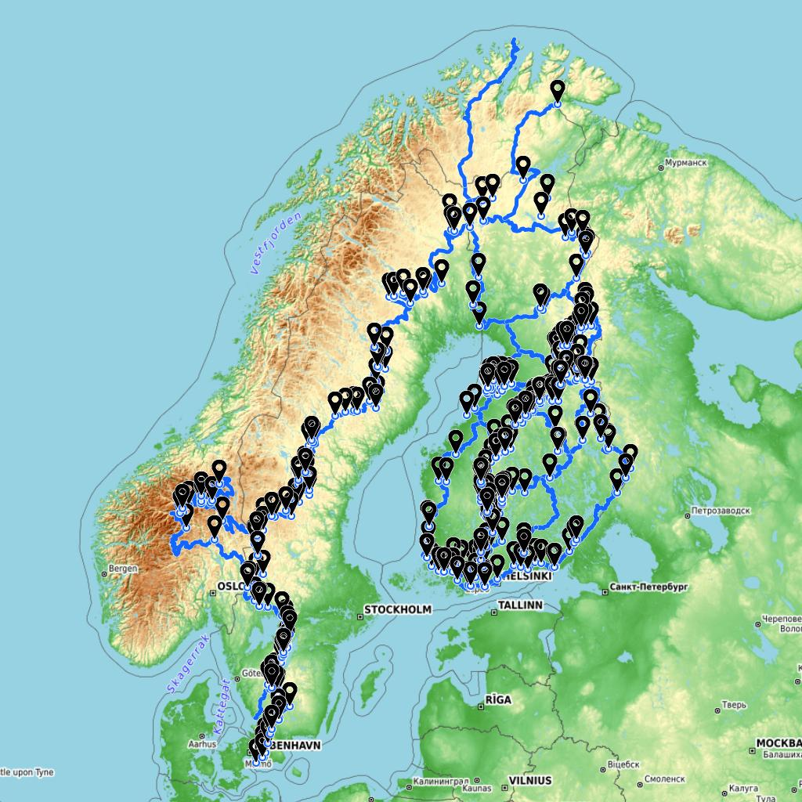
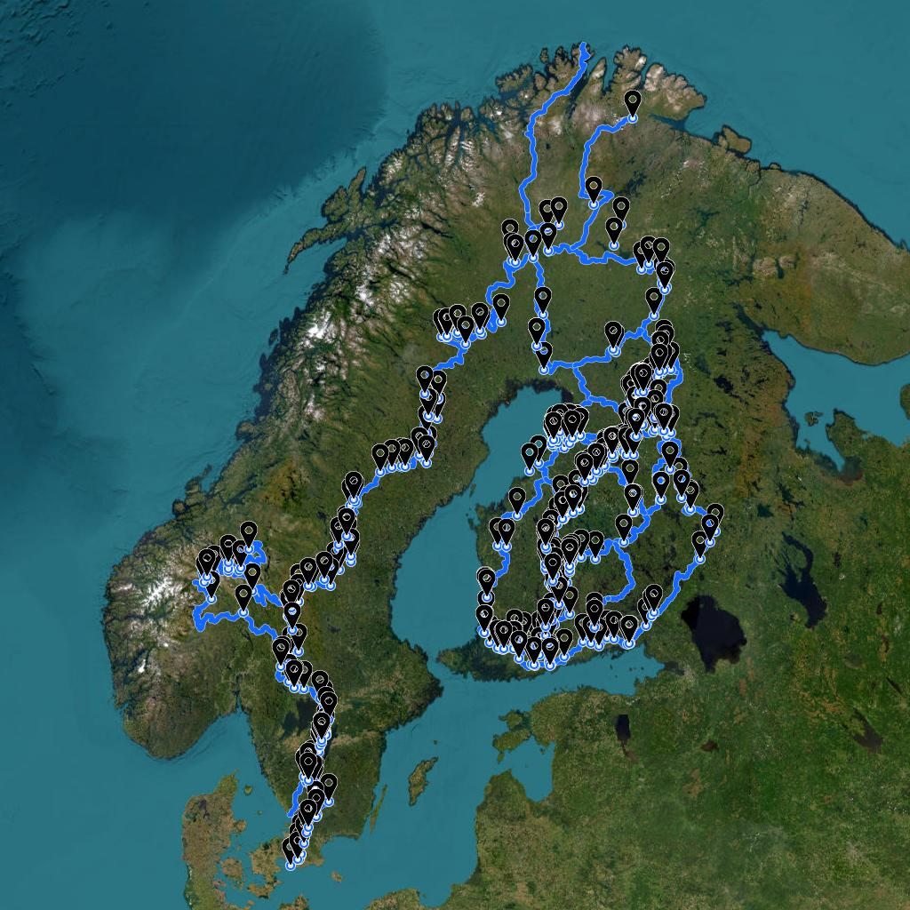

# Georender

Forked from https://github.com/loskoderos/georender.

The original Georender is a command line utility for rendering GPS data as image.
The application was created for server side rendering of GPX files for [GPXLAB - GPS Track Editor](https://gpxlab.net).

This fork encapsulates the command line utility with a basic webserver that allows to upload a gpx file and return the generated image.

## Examples
Following images are generated from GPX tracks from [TransEuroTrail](https://transeurotrail.org/) for Finland, Norway and Sweden.

Use OpenStreetMap

Use OpenTopoMap

Use ESRI World Imagery


## How does it work?
Georender is built with OpenLayers, server side rendering (SSR) is implemented with JSDom.
Application creates a virtual DOM structure to allow OpenLayers render a map. The DOM is monkey patched for missing dependencies to make it work. Once completed the canvas is saved to the output image.

## Options
The underlying Georender command line utility can be run with following options:
- `-w, --width <px>` - Image width in pixels
- `-h, --height <px>` - Image height in pixels
- `-i, --in <input file>` - Path to input file (.geojson, .gpx, .kml, .kmz), supports multiple files
- `-o, --out <output file>` - Name of the output file (.png, .jpg, .jpeg)
- `-t, --tile <name>` - Name of the tile source (osm, otm, esri)

## Customization
You can change default settings by editing `defaults.js`.

## Docker
Georender can work in headless mode in Docker, however due to Canvas usage there are some extra dependencies that need to be installed, see Dockerfile.
The docker image exposes port 3000.

Build docker container:
~~~
docker build -t georender .
~~~

Run Georender in docker:
~~~
docker run georender
~~~

To specify options just append them as command line arguments after the image name:
~~~
docker run georender -w 800 -h 450 -t osm
~~~

## How to use
Send a POST request to http://localhost:3000. Your request must include a gpx file attachment and the name of the input must be `gpx`. 
The server will then render the image and return it in response.

Basic HTML example:
```html
<html>
    <body>
        <form method="post" action="http://localhost:3000" encType="multipart/form-data">
            <input type="file" name="gpx">
            <button type="submit">Send</button>
        </form>
    </body>
</html>
```

## Notes
- To install Georender on Mac M1 chip you may need to run the following command to install Canvas dependencies:
~~~
brew install pkg-config cairo pango libpng jpeg giflib librsvg
~~~
- OpenLayers may use multiple Canvas elements to render a map, however in tests it seems in Node.js only one Canvas is used so the Renderer code is simplified.
- There seems to be a bug in OpenLayers while importing KMZ resulting in ERR_INVALID_URL while Icon href is being parsed pointing to internals of the ZIP file.

## Credits
- [GPXLAB](https://gpxlab.net)
- [OpenStreetMap](https://www.openstreetmap.org/)
- [OpenTopoMap](https://opentopomap.org/)
- [ESRI World Imagery](https://hub.arcgis.com/datasets/esri::world-imagery/about)
- [OpenLayers](https://github.com/openlayers/openlayers)
- [JSDom](https://github.com/jsdom/jsdom)
- [JSZip](https://github.com/Stuk/jszip)
- [ol-ssr](https://github.com/mmomtchev/ol-ssr)

## License
MIT

